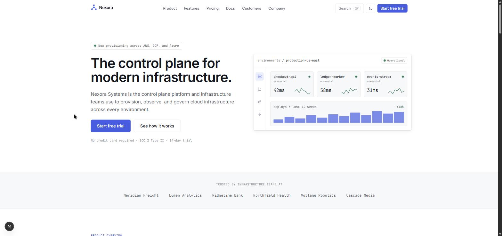
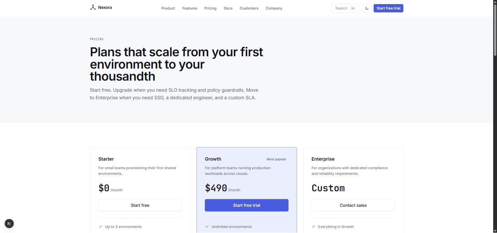

# Nexora Systems — SaaS / Technical Blueprint

A HubZero Focused Blueprint: a complete, production-ready marketing site for a
fictional B2B SaaS company, built on **Blueprint Base** using the **SaaS**
architecture and the **Technical** design language.



This repository contains a fictional demonstration website. It is part of
the [HubZero Blueprint](https://hubzero.in) ecosystem — a system for building
production-quality reference websites. Nexora Systems, and every name,
organization, product, testimonial, contact detail, and case study on this
site, is fictional unless explicitly stated otherwise.

This repository is a reusable foundation, not a one-off client site. Every
piece of business content — company name, copy, pricing, team, customers,
blog posts — lives in configuration and data files so it can be replaced
without touching implementation code.

---

## About this blueprint

**Fictional company:** Nexora Systems — a control plane platform for
provisioning, observing, and governing cloud infrastructure across AWS, GCP,
and Azure. See [Placeholder content](#placeholder-content) below for what's
fictional and where it lives.

**Architecture:** SaaS (`.hubzero/architecture/saas.md`) — product-led
information hierarchy: product → features → platform → integrations →
security → pricing → FAQ → proof → conversion.

**Design language:** Technical (`.hubzero/design/languages/technical.md`) —
precision over decoration, a single disciplined corner/border/shadow system,
diagrams and real product UI instead of photography, and motion that reports
state rather than performs.

**Signature interaction:** a command palette (`⌘K` / `Ctrl+K`) for searching
pages and actions — the one deliberate, restrained signature moment, in
keeping with a developer-tool-appropriate execution of HubZero's floating
navigation philosophy.



---

## Getting started

```bash
npm install
npm run dev
```

The site runs at `http://localhost:3000`.

### Build & verify

```bash
npm run lint       # ESLint
npx tsc --noEmit    # TypeScript
npm run build       # Production build (also type-checks)
npm run start        # Serve the production build locally
```

All three must pass before this blueprint is considered release-ready — see
`.hubzero/release/RELEASE_CHECKLIST.md`.

---

## Folder structure

```
.hubzero/                Blueprint Core — canonical HubZero guidance. Read-only.
src/
  app/                    Next.js App Router routes (one folder per page)
  components/
    brand/                Logo/mark (DOM + satori-safe variants for icon/OG routes)
    icons/                Shared line-icon set
    layout/               Blueprint Base structural primitives (Page, Section, Container)
    marketing/             Page-section components (Hero, PricingTable, FAQSection, ...)
    navigation/            Navbar, MobileNav, Footer, CommandPalette, ThemeToggle
    seo/                    StructuredData helper
    ui/                     Design-system primitives (Button, Card, Badge, Tabs, ...)
  config/                  Site-level configuration — brand, nav, footer, routes
  data/                    Business content — features, pricing, blog, customers, team, careers
  providers/                AppProvider, ThemeProvider (light/dark)
  seo/                      createMetadata, structured data builders, sitemap, robots
  styles/                   Design tokens (tokens.css)
  utils/                    cn(), shared motion timing constants
```

`src/components/layout`, `src/config`, `src/seo`, `src/providers`, `src/lib`,
`src/utils`, and `src/types` are Blueprint Base infrastructure — extended
here, never duplicated.

---

## Customization guide

To rebrand this blueprint for a real company:

1. **Brand identity** — `src/config/site.ts` (name, tagline, description, URL)
   and `src/config/company.ts` (legal name, mission, values, contact, social).
2. **Logo** — `src/components/brand/Mark.tsx` (DOM SVG) and
   `src/components/brand/OgMark.tsx` (the satori-safe version used by
   `icon.tsx`, `apple-icon.tsx`, and `opengraph-image.tsx`). Both encode the
   same geometry; update both together.
3. **Design tokens** — `src/styles/tokens.css` for color, radius, shadow, and
   motion. `src/app/globals.css` maps these onto Tailwind utilities via
   `@theme inline`.
4. **Navigation & footer** — `src/config/navigation.ts`, `src/config/footer.ts`.
5. **Business content** — everything under `src/data/`: `features.ts`,
   `pricing.ts`, `integrations.ts`, `testimonials.ts`, `customers.ts`,
   `blog.ts`, `team.ts`, `careers.ts`, `faq.ts`.
6. **Legal copy** — `src/app/privacy/page.tsx` and `src/app/terms/page.tsx`
   contain placeholder policies. Replace with counsel-reviewed terms before
   using this in production.

No component should need editing for a rebrand — only configuration, data,
and the two brand-mark files above.

---

## Placeholder content

Everything about Nexora Systems is fictional, generated for this blueprint:

- **Company, product, and team** — Nexora Systems and everyone in
  `src/data/team.ts` are invented. Contact details in `src/config/company.ts`
  (`nexora.hubzero.in` addresses and social handles) are placeholders.
- **Customers & case studies** — `src/data/customers.ts`. Meridian Freight,
  Lumen Analytics, Ridgeline Bank, Northfield Health, Voltage Robotics, and
  Cascade Media are fictional companies invented for this blueprint.
- **Blog posts** — `src/data/blog.ts`, three original articles written for
  this blueprint.
- **Pricing, features, integrations, careers** — `src/data/pricing.ts`,
  `features.ts`, `integrations.ts`, `careers.ts`. Integration tiles name real
  third-party product categories (AWS, Terraform, GitHub Actions, etc.) only
  to illustrate realistic compatibility — no partnership is implied.
- **Legal pages** — `/privacy` and `/terms` contain generic SaaS boilerplate
  clearly marked as placeholder in-page.
- **Imagery** — there is no photography. Every visual (dashboard preview,
  architecture diagram, charts, avatars, brand mark, OG image) is coded
  UI/SVG, per the Technical design language's photography guidance.

---

## Design system

- **Theme** — light/dark, system-aware by default, toggle persisted to
  `localStorage`. See `src/providers/ThemeProvider.tsx`.
- **Tokens** — one radius, hairline borders, a single elevated-shadow value,
  a neutral scale plus one accent and a status palette (success/warning/danger)
  reused for both UI chrome and data (latency, uptime, deploy charts).
  `src/styles/tokens.css`.
- **Typography** — Inter (UI/body) and JetBrains Mono (code, data,
  identifiers), loaded via `next/font/google` in `src/app/layout.tsx`.
- **Motion** — `src/utils/motion.ts` exports the shared duration/easing
  fragments used across every interactive component.

---

## Tech stack

Next.js (App Router) · React 19 · TypeScript · Tailwind CSS v4 · Zod ·
class-variance-authority

Built on **Blueprint Base**, the shared HubZero engineering foundation. See
`.hubzero/README.md` for the full Blueprint Core philosophy.
